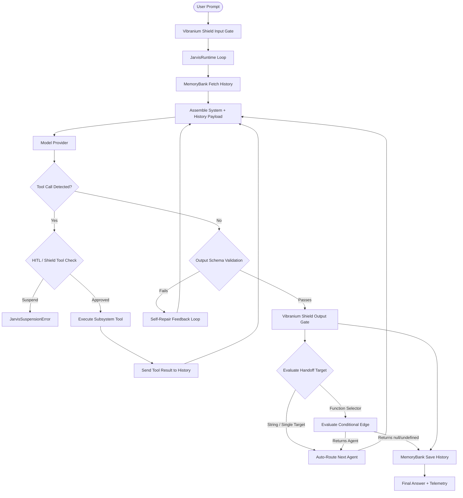

# JarvisAgentSDK Operations Manual

Welcome to the **J.A.R.V.I.S. Operations Manual**. This guide provides a detailed API reference for developers integrating the SDK into advanced autonomous networks, diagnostic pipelines, agentic developer toolkits, or custom model provider configurations.

---

## Table of Contents
1. [Core Architecture](#core-architecture)
2. [JarvisAgent (Protocol)](#jarvisagent-protocol)
3. [JarvisTool (Subsystem)](#jarvistool-subsystem)
4. [JarvisRuntime (Suit OS)](#jarvisruntime-suit-os)
5. [Multi-Agent Handoff Topology](#multi-agent-handoff-topology)
6. [Human-in-the-Loop (HITL) & Execution Suspension](#human-in-the-loop-hitl--execution-suspension)
7. [VibraniumShield (Guardrails)](#vibraniumshield-guardrails)
8. [MemoryBanks (Storage & Cognitive Store)](#memorybanks-storage--cognitive-store)
9. [ArcReactor (Diagnostics)](#arcreactor-diagnostics)

---

## Core Architecture

The SDK adopts a decoupled, event-driven runtime architecture:
- **State Preservation**: Invocations are stateless. All states are fetched from a `MemoryBank` at the start of a run and pushed back upon completion.
- **Unified Providers**: Language model calls are normalized across OpenAI, Anthropic, Gemini, and OpenAI-compatible providers (Mistral, vLLM, Ollama, DeepSeek) using adapters implementing the `ModelProvider` contract.
- **Compatibility Mode**: Automatically detects custom `baseURL` endpoints and adapts structured outputs using system-prompt JSON schema injections and robust `extractFirstJson()` parsing.
- **Fence-Safe Tools**: Built-in protection against LLM markdown block wrappers (` ```typescript `) when creating or writing code files.



---

## JarvisAgent (Protocol)

A `JarvisAgent` is a declarative container representing a specialized task handler (e.g., `CodingAgent`, `FileAgent`, `ReviewAgent`).

### Constructor Options
- `name` (string): Alphanumeric identifier, must be unique within the runtime.
- `instructions` (string | function): Prompts defining the agent's behavior. Can be an asynchronous function evaluating current run context.
- `model` (string): The designated model identifier for this agent.
- `provider` (string | ModelProvider): Provider instance or registered provider key.
- `tools` (array): List of custom `JarvisTool` instances.
- `guardrails` (VibraniumShieldConfig): Custom input/output filters and tool execution checks.
- `outputSchema` (ZodType): Expected JSON structure validation.
- `hitl` (boolean | string[]): Enables first-class Human-in-the-Loop review. Pass `true` to suspend on all tool calls, or an array of tool names (e.g., `["write_code_file"]`).

---

## JarvisTool (Subsystem)

Subsystems are the tools available to your protocols. They parse arguments using Zod schemas to guarantee type safety before firing callbacks.

### Factory Method
`createTool({ name, description, parameters, execute })`
- `name` (string): Alphanumeric tool identifier.
- `description` (string): Detailed text explaining when the model should invoke the tool.
- `parameters` (ZodObject): Zod schema for arguments.
- `execute` (async function): Execution callback logic returning string or JSON objects.

```typescript
const writeCodeFile = createTool({
  name: "write_code_file",
  description: "Write source code to disk",
  parameters: z.object({
    filePath: z.string(),
    codeContent: z.string(),
  }),
  execute: async ({ filePath, codeContent }) => {
    // Fences stripped automatically if model wraps output in markdown code blocks
    const stripped = codeContent.replace(/^```[^\n]*\n([\s\S]*?)```\s*$/m, "$1").trim();
    await fs.writeFile(filePath, stripped + "\n", "utf-8");
    return `Saved file to ${filePath}`;
  },
});
```

---

## JarvisRuntime (Suit OS)

`JarvisRuntime` is the main loop manager, orchestrating prompt construction, schema validation, tool execution, handoff routing, and session history persistence.

### Methods & Options
- `run({ sessionId, input, agentName, outputSchema })`: Runs the main agent loop.
- `resume(sessionId, approved)`: Resumes a suspended run after human authorization.
- `on(event, listener)`: Listens to runtime events (`text:chunk`, `tool:start`, `tool:end`, `handoff:start`, `run:complete`).

---

## Multi-Agent Handoff Topology

JarvisAgentSDK provides three flexible, industry-aligned handoff modes configured via `handOff`:

```typescript
export type HandoffTarget = 
  | string 
  | string[] 
  | ((result: string, context?: any) => string | null | undefined | Promise<string | null | undefined>);
```

### 1. Direct Single Target (Auto-Routing)
When an agent has a single target string (e.g. `CodingAgent: "FileAgent"`), the runtime automatically routes context to the target agent upon completion—no LLM tool call required.

### 2. Multi-Target LLM Selection (Swarm-style)
When configured with an array of targets (e.g. `TriageAgent: ["BillingAgent", "SupportAgent"]`), the runtime dynamically attaches `transfer_to_<AgentName>` tools, allowing the model to choose the next handler.

### 3. Conditional Edge Selectors (LangGraph-style)
Pass a function `(output, context) => string | null` to evaluate output programmatically and decide the next node:

```typescript
const runtime = new JarvisRuntime({
  agents: [codingAgent, fileAgent, reviewAgent],
  defaultAgent: "CodingAgent",
  handOff: {
    CodingAgent: "FileAgent",
    FileAgent: "ReviewAgent",
    ReviewAgent: (output) => {
      const review = JSON.parse(output);
      // Loop back to CodingAgent if issues found; return null to finish run cleanly
      return review.isOptimal ? null : "CodingAgent";
    },
  },
  maxHandoffs: 6,
});
```

---

## Human-in-the-Loop (HITL) & Execution Suspension

Configure granular tool authorization directly on individual agents:

```typescript
const fileAgent = new JarvisAgent({
  name: "FileAgent",
  instructions: "Write code to disk.",
  tools: [writeCodeFile],
  hitl: ["write_code_file"], // Requires human authorization before writing files
});
```

When a protected tool call is attempted, `runtime.run()` throws a `JarvisSuspensionError`. Inspect `err.pendingToolCall` and call `runtime.resume(sessionId, approved)` with user feedback to proceed or block execution.

---

## VibraniumShield (Guardrails)

Provide guardrails at three levels:
1. `beforeInput(input, context)`: Intercepts raw user queries.
2. `afterOutput(output, context)`: Cleans or rewrites responses before returning.
3. `beforeToolExecute(toolCall, context)`: Verifies tool parameters or prompts for manual approval.

---

## MemoryBanks (Storage & Cognitive Store)

Pluggable adapters maintain context across sessions.
- `InMemoryMemoryBank`: Ephemeral storage for fast local testing.
- `SqliteMemoryBank`: Persistent SQLite storage supporting facts, long-term state, and message logs.

---

## ArcReactor (Diagnostics)

Telemetry accumulator recording:
- Prompt/Completion token totals.
- Agent handoff counts and trace pathways.
- Active system errors and execution step latencies.
- Full step-by-step histories.

